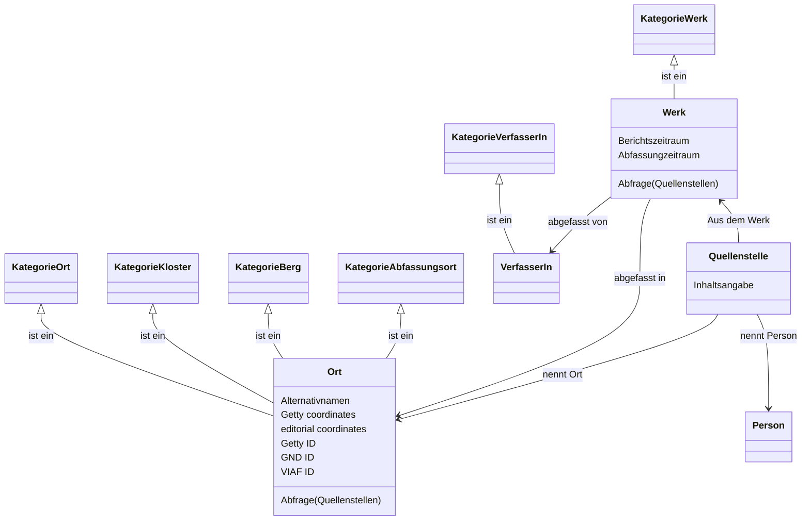

```mermaid

classDiagram

    class KategorieWerk
    KategorieWerk <|-- Werk : ist ein 
    
    class KategorieOrt
    KategorieOrt <|-- Ort : ist ein 
    
    class KategorieKloster
    KategorieKloster <|-- Ort : ist ein 
    
    class KategorieBerg
    KategorieBerg <|-- Ort : ist ein 
    
    class KategorieAbfassungsort
    KategorieAbfassungsort <|-- Ort : ist ein 
    
    class KategorieVerfasserIn
    KategorieVerfasserIn <|-- VerfasserIn : ist ein 

    class Werk
    Werk: Berichtszeitraum 
    Werk: Abfassungzeitraum
    Werk <-- Quellenstelle : Aus dem Werk
    Werk --> VerfasserIn : abgefasst von
    Werk --> Ort : abgefasst in
    Werk: Abfrage(Quellenstellen)
    
    class VerfasserIn

    class Quellenstelle
    Quellenstelle: Inhaltsangabe
    Quellenstelle --> Person : nennt Person
    Quellenstelle --> Ort : nennt Ort  

    class Person

    class Ort
    Ort: Alternativnamen
    Ort: Getty coordinates
    Ort: editorial coordinates
    Ort: Getty ID
    Ort: GND ID
    Ort: VIAF ID
    Ort: Abfrage(Quellenstellen)
    
end

```