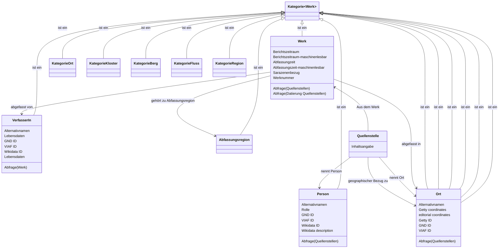

```mermaid

classDiagram

    class Kategorie~Werk~
    Kategorie~Werk~ <|-- Werk : ist ein 
    
    class Kategorie~Person~
    Kategorie~Person~ <|-- Person : ist ein 
    
    class Kategorie~VerfasserIn~
    Kategorie~VerfasserIn~ <|-- VerfasserIn : ist ein 
    
    class Kategorie~Abfassungsregion~
    Kategorie~Abfassungsregion~ <|-- Abfassungsregion : ist ein 
    
    class Kategorie~Geographie~
    Kategorie~Geographie~ <|-- KategorieOrt: ist ein
    Kategorie~Geographie~ <|-- KategorieKloster: ist ein
    Kategorie~Geographie~ <|-- KategorieBerg: ist ein
    Kategorie~Geographie~ <|-- KategorieFluss: ist ein
    Kategorie~Geographie~ <|-- KategorieRegion: ist ein
    
    class Kategorie~Ort~
    Kategorie~Ort~ <|-- Ort : ist ein 
    
    class Kategorie~Kloster~
    Kategorie~Kloster~ <|-- Ort : ist ein 
    
    class Kategorie~Berg~
    Kategorie~Berg~ <|-- Ort : ist ein 
    
    class Kategorie~Fluss~
    Kategorie~Fluss~ <|-- Ort : ist ein 
    
    class Kategorie~Region~
    Kategorie~Region~ <|-- Ort : ist ein
    
    class Kategorie~Abfassungsort~
    Kategorie~Abfassungsort~ <|-- Ort : ist ein 
    
    class Abfassungsregion
    
    class Werk
    Werk: Berichtszeitraum 
    Werk: Berichtszeitraum-maschinenlesbar
    Werk: Abfassungzeit
    Werk: Abfassungszeit-maschinenlesbar
    Werk: Sarazenenbezug
    Werk: Werknummer
    Werk <-- Quellenstelle : Aus dem Werk
    Werk --> VerfasserIn : abgefasst von
    Werk --> Ort : abgefasst in
    Werk --> Abfassungsregion : gehört zu Abfassungsregion
    Werk: Abfrage(Quellenstellen)
    Werk: Abfrage(Datierung Quellenstellen)
    
    class VerfasserIn
    VerfasserIn: Alternativnamen
    VerfasserIn: Lebensdaten
    VerfasserIn: GND ID
    VerfasserIn: VIAF ID
    VerfasserIn: Wikidata ID
    VerfasserIn: Lebensdaten
    VerfasserIn: Abfrage(Werk)

    class Quellenstelle
    Quellenstelle: Inhaltsangabe
    Quellenstelle --> Person : nennt Person
    Quellenstelle --> Ort : nennt Ort  
    Quellenstelle --> Ort : geographischer Bezug zu 

    class Person
    Person: Alternativnamen
    Person: Rolle
    Person: GND ID
    Person: VIAF ID
    Person: Wikidata ID
    Person: Wikidata description
    Person: Abfrage(Quellenstellen)

    class Ort
    Ort: Alternativnamen
    Ort: Getty coordinates
    Ort: editorial coordinates
    Ort: Getty ID
    Ort: GND ID
    Ort: VIAF ID
    Ort: Abfrage(Quellenstellen)
    
end

```