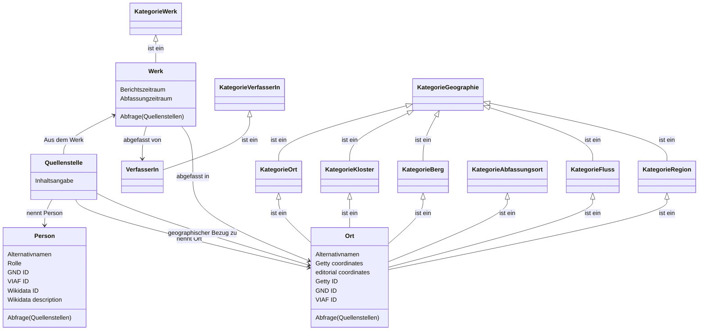

```mermaid

classDiagram

    class KategorieWerk
    KategorieWerk <|-- Werk : ist ein 
    
    cass KategorieVerfasserIn
    KategorieVerfasserIn <|-- VerfasserIn : ist ein 
    
    class KategorieGeographie
    KategorieGeographie <|-- KategorieOrt: ist ein
    KategorieGeographie <|-- KategorieKloster: ist ein
    KategorieGeographie <|-- KategorieBerg: ist ein
    KategorieGeographie <|-- KategorieFluss: ist ein
    KategorieGeographie <|-- KategorieRegion: ist ein
    
    class KategorieOrt
    KategorieOrt <|-- Ort : ist ein 
    
    class KategorieKloster
    KategorieKloster <|-- Ort : ist ein 
    
    class KategorieBerg
    KategorieBerg <|-- Ort : ist ein 
    
    class KategorieFluss
    KategorieFluss <|-- Ort : ist ein 
    
    class KategorieRegion
    KategorieRegion <|-- Ort : ist ein
    
    class KategorieAbfassungsort
    KategorieAbfassungsort <|-- Ort : ist ein 
    
    class Werk
    Werk: Berichtszeitraum 
    Werk: Abfassungzeitraum
    Werk <-- Quellenstelle : Aus dem Werk
    Werk --> VerfasserIn : abgefasst von
    Werk --> Ort : abgefasst in
    Werk: Abfrage(Quellenstellen)
    
    class VerfasserIn

    class Quellenstelle
    Quellenstelle: Inhaltsangabe
    Quellenstelle --> Person : nennt Person
    Quellenstelle --> Ort : nennt Ort  
    Quellenstelle --> Ort : geographischer Bezug zu 

    class Person
    Person: Alternativnamen
    Person: Rolle
    Person: GND ID
    Person: VIAF ID
    Person: Wikidata ID
    Person: Wikidata description
    Person: Abfrage(Quellenstellen)

    class Ort
    Ort: Alternativnamen
    Ort: Getty coordinates
    Ort: editorial coordinates
    Ort: Getty ID
    Ort: GND ID
    Ort: VIAF ID
    Ort: Abfrage(Quellenstellen)
    
end

```