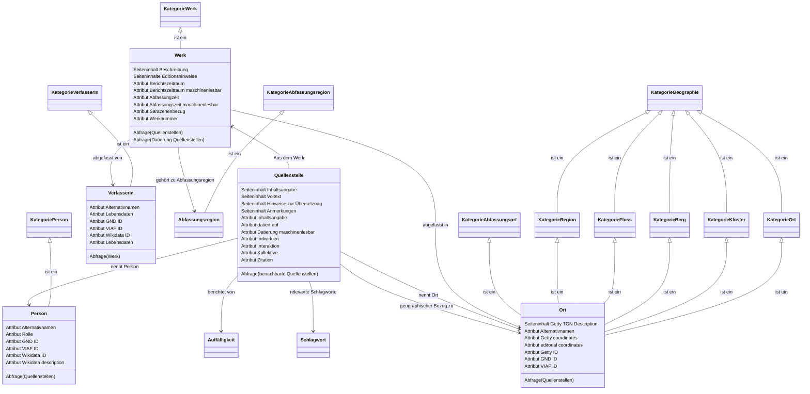

```mermaid

classDiagram

    class KategorieWerk
    
    KategorieWerk <|-- Werk : ist ein 
    
    class KategoriePerson
    KategoriePerson <|-- Person : ist ein 
    
    class KategorieVerfasserIn
    KategorieVerfasserIn <|-- VerfasserIn : ist ein 
    
    class KategorieAbfassungsregion
    KategorieAbfassungsregion <|-- Abfassungsregion : ist ein 
    
    class KategorieGeographie
    KategorieGeographie <|-- KategorieOrt: ist ein
    KategorieGeographie <|-- KategorieKloster: ist ein
    KategorieGeographie <|-- KategorieBerg: ist ein
    KategorieGeographie <|-- KategorieFluss: ist ein
    KategorieGeographie <|-- KategorieRegion: ist ein
    
    class KategorieOrt
    KategorieOrt <|-- Ort : ist ein 
    
    class KategorieKloster
    KategorieKloster <|-- Ort : ist ein 
    
    class KategorieBerg
    KategorieBerg <|-- Ort : ist ein 
    
    class KategorieFluss
    KategorieFluss <|-- Ort : ist ein 
    
    class KategorieRegion
    KategorieRegion <|-- Ort : ist ein
    
    class KategorieAbfassungsort
    KategorieAbfassungsort <|-- Ort : ist ein 
    
    class Abfassungsregion
    
    class Werk
    Werk: Seiteninhalt Beschreibung
    Werk: Seiteninhalte Editionshinweise
    Werk: Attribut Berichtszeitraum 
    Werk: Attribut Berichtszeitraum maschinenlesbar
    Werk: Attribut Abfassungzeit
    Werk: Attribut Abfassungszeit maschinenlesbar
    Werk: Attribut Sarazenenbezug
    Werk: Attribut Werknummer
    Werk <-- Quellenstelle : Aus dem Werk
    Werk --> VerfasserIn : abgefasst von
    Werk --> Ort : abgefasst in
    Werk --> Abfassungsregion : gehört zu Abfassungsregion
    Werk: Abfrage(Quellenstellen)
    Werk: Abfrage(Datierung Quellenstellen)
    
    class VerfasserIn
    VerfasserIn: Attribut Alternativnamen
    VerfasserIn: Attribut Lebensdaten
    VerfasserIn: Attribut GND ID
    VerfasserIn: Attribut VIAF ID
    VerfasserIn: Attribut Wikidata ID
    VerfasserIn: Attribut Lebensdaten
    VerfasserIn: Abfrage(Werk)

    class Quellenstelle
    Quellenstelle: Seiteninhalt Inhaltsangabe
    Quellenstelle: Seiteninhalt Voltext
    Quellenstelle: Seiteninhalt Hinweise zur Übersetzung
    Quellenstelle: Seiteninhalt Anmerkungen
    Quellenstelle: Attribut Inhaltsangabe
    Quellenstelle: Attribut datiert auf
    Quellenstelle: Attribut Datierung maschinenlesbar
    Quellenstelle: Attribut Individuen
    Quellenstelle: Attribut Interaktion
    Quellenstelle: Attribut Kollektive
    Quellenstelle: Attribut Zitation
    Quellenstelle --> Auffälligkeit : berichtet von
    Quellenstelle --> Person : nennt Person
    Quellenstelle --> Ort : nennt Ort  
    Quellenstelle --> Ort : geographischer Bezug zu 
    Quellenstelle --> Schlagwort : relevante Schlagworte
    Quellenstelle: Abfrage(benachbarte Quellenstellen)

    class Person
    Person: Attribut Alternativnamen
    Person: Attribut Rolle
    Person: Attribut GND ID
    Person: Attribut VIAF ID
    Person: Attribut Wikidata ID
    Person: Attribut Wikidata description
    Person: Abfrage(Quellenstellen)

    class Ort
    Ort: Seiteninhalt Getty TGN Description
    Ort: Attribut Alternativnamen
    Ort: Attribut Getty coordinates
    Ort: Attribut editorial coordinates
    Ort: Attribut Getty ID
    Ort: Attribut GND ID
    Ort: Attribut VIAF ID
    Ort: Abfrage(Quellenstellen)
    
    class Auffälligkeit
    
    class Schlagwort

end

```